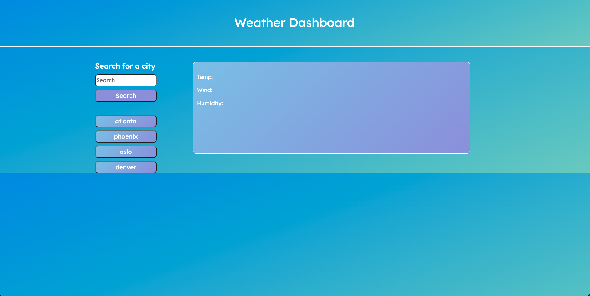
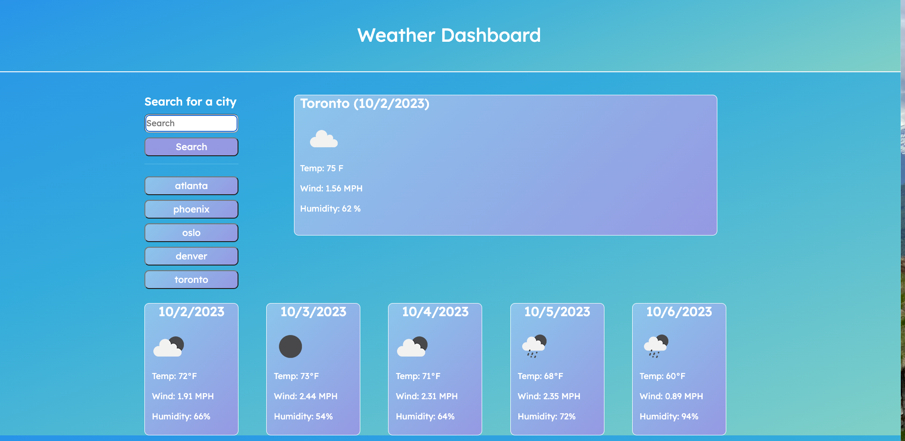
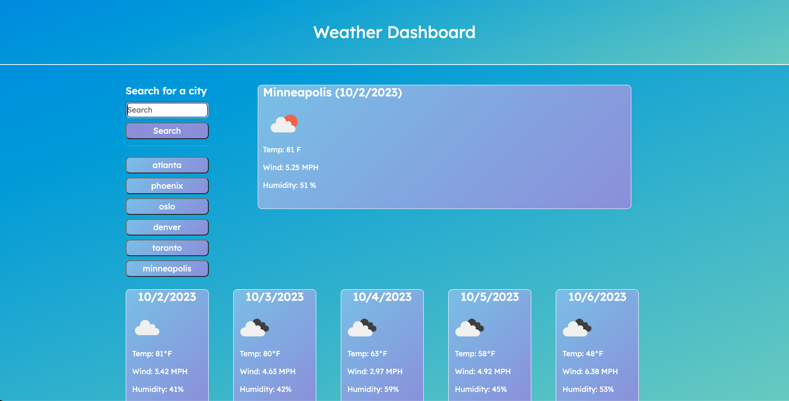
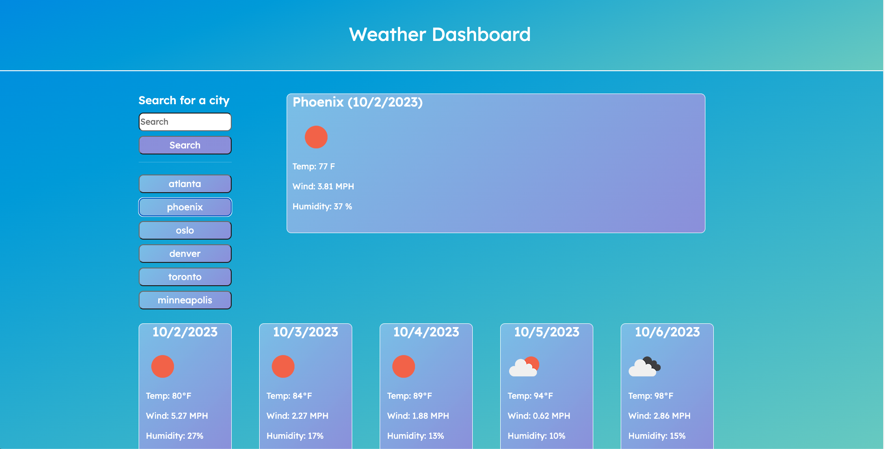

# weather-dashboard
## Description
Provide a short description explaining the what, why, and how of your project. Use the following questions as a guide:
- My motivation for this project was to be able to successfully pull data from a third party API and interact with that information. I also wanted to use Bootstrap for styling and get familiar with that tool.
- I built this project to understand the use of APIs and to expand my knowledge on JavaScript.
- This application solves the problem of being able to look at current weather data for any city and what the forecast will be over the next 5 days.
- I learned how to use API data to deliver real time information that any user can access. I learned about fetch and more indepth uses of functions.
## Installation
To install this application, click on the link below to access it in your web browser.
https://dylanhoryza.github.io/weather-dashboard/
## Usage
The following screenshots show how this project is used. Search for any city and the weather forecast will pull up. The latest searched city will save as a button on the left hand side. You can access previously searched cities by clicking on the corresponding button.
   
   
   
   
   
   
## Credits
My tutor, Mila Hose helped me with local storage and saving the searched cities to new buttons.
## License
N/A
---

